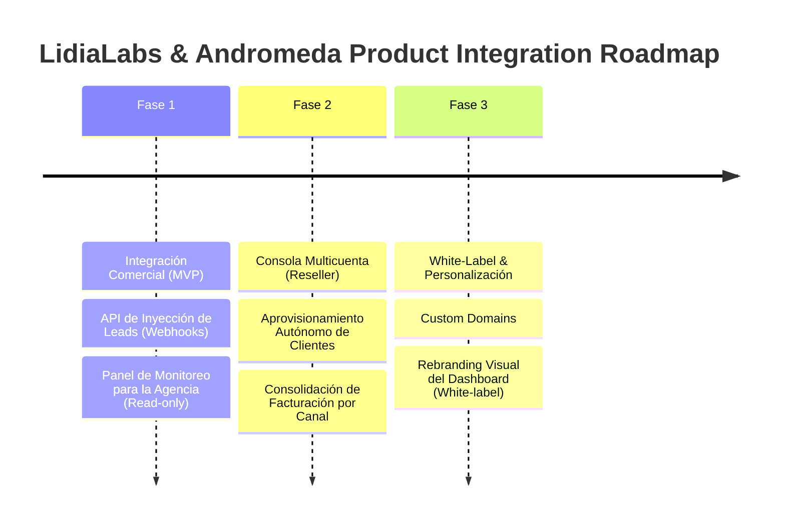

# Product Roadmap & Business Model Evaluation: The Andromeda Partnership

**Análisis de Estrategia de Producto e Impacto en Negocio**
*Autor: AI Strategy & Discovery PM*
*Fecha: 1 de Junio de 2026*

---

## 1. El Problema & Oportunidad de Mercado

**Andrómeda** representa a un **Canal GTM (Go-to-Market)** y no solo a un cliente final. Su red de ventas y cartera de clientes (Médicos, PYMEs y Corporativos) puede escalar el LTV agregado de LidiaLabs, pero introduce fricción operativa si cada onboarding se hace de forma manual y artesanal por nuestro equipo técnico.

### Objetivos Clave (Outcomes > Outputs)
* **North Star Metric:** Tiempo desde el cierre de la venta hasta el "First AI Interaction" del cliente final < 24 horas.
* **Métrica de Rentabilidad:** Reducir el CAC indirecto a $0 a través del apalancamiento de los vendedores de Andrómeda.
* **Métrica de Retención:** Churn de cuentas del canal < 3% mensual a través de empaquetamiento comercial de alto valor.

---

## 2. Modelos de Negocio vs. Requerimientos de Producto

Evaluamos las tres opciones de producto según el modelo comercial que acordemos con Andrómeda:

### Modelo 1: Partner Reseller (Consola de Administración de Cuentas)
* **Concepto:** Andrómeda revende Lidia con su precio público o markup. LidiaLabs factura a Andrómeda a precio de descuento consolidado.
* **Impacto en Producto:**
  * Requiere un módulo de **Multi-tenancy Jerárquico** (Consola Partner).
  * Andrómeda debe poder aprovisionar, suspender y ver la telemetría básica de las cuentas de sus clientes sin intervención de LidiaLabs.
* **Viabilidad:** Alta y rápida. Es el estándar para agencias de RevOps.

### Modelo 2: White-Label (Marca Blanca)
* **Concepto:** Lidia desaparece visualmente. El sistema se vende como "Andrómeda Conversational Agent".
* **Impacto en Producto:**
  * Dominios personalizados (e.g., `ia.andromeda.agency`).
  * Personalización de logos, colores, correos de notificación e interfaz de CRM.
  * Mayor complejidad técnica en certificados SSL dinámicos y aislamiento de datos.
* **Viabilidad:** Media. Alta rentabilidad (permite cobrar un *Premium Setup Fee* recurrente) pero introduce *process creep* de soporte.

### Modelo 3: Co-Branding / Integración de Campañas (El Flywheel de Crecimiento)
* **Concepto:** Los leads generados por las campañas de publicidad de Andrómeda (Meta Ads, Google Ads) se inyectan automáticamente en Lidia a través de webhooks nativos, creando un ciclo cerrado: **Atracción (Andrómeda) + Conversión Autónoma (Lidia)**.
* **Impacto en Producto:**
  * API pública de Lidia o integraciones nativas con Zapier, Make e inyección directa desde Facebook Lead Forms.
* **Viabilidad:** Máxima prioridad de conversión. Mueve la aguja de ventas del cliente final inmediatamente.

---

## 3. Product Roadmap Propuesto (Enfoque MVP Quirúrgico)

### Fase 1: Integración de Leads & Demo Sandbox (Q3 2026)
* **Objetivo:** Demostrar valor de conversión inmediatamente para los clientes de Andrómeda.
* **Entregables de Producto:**
  * **Lead Injection Webhook:** Endpoint rápido para que cuando un lead llene un formulario de Meta Ads de Andrómeda, Lidia le escriba al WhatsApp en menos de 5 segundos.
  * **Agency View:** Permitir a Andrómeda agregar una etiqueta `partner:andromeda` a sus clientes y tener acceso de visualización de métricas en un dashboard unificado.
  * **Bucle de Feedback Manual:** Envío de formularios manuales nativos de LidiaLabs a los primeros usuarios piloto para recopilar retroalimentación cualitativa directa de las implementaciones mientras se automatiza el proceso.

### Fase 2: Consola de Administración (Reseller Console) (Q4 2026)
* **Objetivo:** Descentralizar el soporte y la facturación.
* **Entregables de Producto:**
  * **Partner Dashboard:** Consola desde la cual Andrómeda puede crear nuevas instancias de Lidia (aprovisionamiento automático).
  * **Wholesale Billing Manager:** Sistema que consolida el consumo de WhatsApp API/Tokens de todas las cuentas secundarias bajo una sola factura mensual para Andrómeda.

### Fase 3: White-Label Avanzado (Q1 2027)
* **Objetivo:** Maximizar el margen de Andrómeda a cambio de un fee anual por marca blanca.
* **Entregables de Producto:**
  * Soporte de CNAME (Dominios propios de la agencia).
  * Custom Styling (CSS dinámico y cambio de logo en el CRM/Dashboard).

---

## 4. Evaluación de Riesgos (Fricción / Carga Cognitiva)

* **Riesgo 1: Soporte Técnico Desbordado.** Si los clientes finales de Andrómeda no entienden cómo calibrar el agente, saturarán a LidiaLabs.
  * *Mitigación:* Andrómeda debe actuar como nivel 1 de soporte. LidiaLabs proveerá un **Onboarding Playbook de Autoservicio** para el equipo de Delivery de Andrómeda.
* **Riesgo 2: Consumo de Recursos (API Keys / WhatsApp Business Cloud).** El aprovisionamiento automático de números de WhatsApp puede volverse complejo.
  * *Mitigación:* En el MVP, los clientes deben conectar su propio número mediante código QR o configuración manual guiada por el equipo de Andrómeda, sin automatizar la creación de Embedded Signup de Meta.
