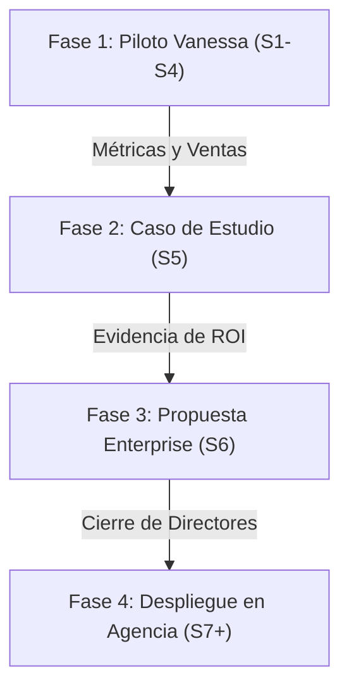

# ROADMAP DE VALIDACIÓN Y ESCALA: Real Estate Enterprise

**Objetivo:** Validar la infraestructura de LidiaLabs a través del piloto con Vanessa Osorno (Dorado 5) para empaquetar un caso de éxito y cerrar la suscripción **Enterprise** con la dirección de su agencia inmobiliaria corporativa.

---

## 1. Estructura de la Propuesta Comercial
Para el mercado inmobiliario, LidiaLabs operará bajo el siguiente esquema conceptual:

*   **Plan Pro (Asesor Independiente):** Suscripción para asesores individuales que gestionan su propio flujo de leads y calendario.
*   **Plan Enterprise (Corporativo):** 
    *   **Consola Central:** Para que los directores monitoreen leads de toda la agencia en tiempo real.
    *   **Licencias por Volumen (Wholesale Tiers) para asesores:** Licencias para los asesores de la plantilla, con tarifas ajustadas según el volumen de asesores activos.

---

## 2. Roadmap Estratégico (Fase a Fase)

### FASE 1: Validación y Tracción Individual (Semanas 1 a 4)
*   **Acción 1.1:** Validar la conexión activa con los canales de Vanessa (WhatsApp, Meta, Instagram) en coordinación con el CTO.
*   **Acción 1.2:** Onboarding de Vanessa (carga de inventario de propiedades y capacitación en el entorno y sistema de calendario propietario de LidiaLabs).
*   **Acción 1.3:** Puesta en marcha del flujo en vivo con monitoreo activo y analítica integrada para Vanessa y nuestro equipo.
*   **Métricas a medir (El "Aha! Moment" de negocio):**
    *   *Tasa de Calificación:* % de leads filtrados (curiosos descartados vs calificados).
    *   *Tasa de Agendamiento:* % de leads calificados que confirman cita en nuestro calendario propietario.
    *   *Ventas Cerradas:* Transacciones de alto ticket cerradas originadas directamente por las citas de Lidia.

### FASE 2: Empaquetamiento del Caso de Éxito (Semana 5)
*   **Acción 2.1:** Diseñar un reporte minimalista (estilo *Executive Memo*) que resuma los resultados de Vanessa.
*   **Narrativa de Venta:** *"Cómo un solo asesor inmobiliario automatizó el 90% de su prospección y cerró [X] ventas de alto ticket en 30 días usando infraestructura autónoma"*.
*   **Preparación:** Validar los datos con Vanessa y obtener su testimonio/apoyo como embajadora interna del producto dentro de la agencia.

### FASE 3: El Pitch Corporativo (Semana 6)
*   **Objetivo:** Presentar LidiaLabs a los directores de la agencia inmobiliaria de Vanessa para su despliegue general.
*   **El Enfoque del Pitch:** 
    *   No vendemos software; vendemos **citas calificadas directamente en tu calendario**.
    *   Le demostramos al director que la velocidad promedio de respuesta humana a leads digitales es de horas, mientras que Lidia responde en **segundos**, asegurando citas confirmadas de forma autónoma antes de que el lead pierda interés.
*   **La Propuesta Comercial (Enterprise):**
    *   Suscripción de Consola Central para que el director monitoree el pipeline y las citas de toda la agencia en tiempo real.
    *   Licencias por volumen (Wholesale Tiers) para los asesores activos de la plantilla.

### FASE 4: Escala y Despliegue Corporativo (Semana 7+) [FASE SUJETA A VALIDACIÓN DE RESULTADOS]
*   **¿Qué es esta fase?:** Esta fase consiste en el despliegue general y escalado de LidiaLabs en toda la agencia corporativa, condicionada a la validación de los resultados de conversión, ROI y generación de citas calificadas obtenidos en el piloto con Vanessa.
*   **Acción 4.1:** Integración de Lidia con el CRM central de la agencia.
*   **Acción 4.2:** Onboarding masivo de asesores de la agencia.
*   **Acción 4.3:** Soporte escalonado: la administración de la agencia maneja las configuraciones básicas (Nivel 1), y LidiaLabs atiende la infraestructura crítica de backend (Nivel 2).
