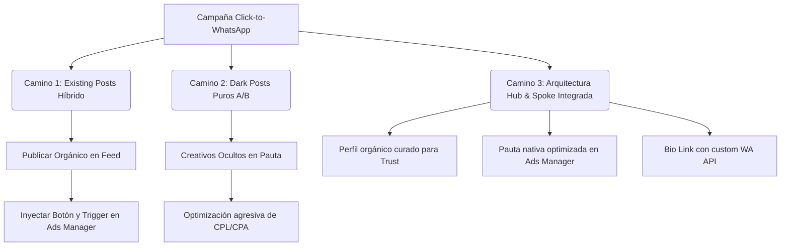

# Evaluación Técnica y GTM: Campaña de Conversión en Meta Ads (Piloto Vanessa Osorno)

**Autor:** Operación LidiaLabs  
**Para:** Diego Islas (Sales Solutions Owner), Eugenio (Director / Brand Strategy), Federico (Tech Lead)  
**Fecha:** 15 de Julio de 2026  
**Propósito:** Definir el mapa técnico y estratégico de Meta Ads para la residencia de Castaños del Vergel, asegurando la cohesión entre la confianza de marca (Branding) y la conversión conversacional de la IA (Lidia).

---

## 1. El Dilema del Alto Ticket: Confianza (Branding) vs. Eficiencia (Ad Conversion)

En el mercado inmobiliario de Carretera Nacional (Monterrey, NL), el ticket de las propiedades oscila entre los **$10M y $25M MXN**. A esta escala, la conversión no depende únicamente del algoritmo de Meta; depende de la **confianza percibida (Trust Score)**.

*   **El Riesgo de los "Dark Posts" Puros (Anuncios sin perfil):** Si un prospecto de alto perfil ve un anuncio hermoso, pero al hacer clic en el perfil del anunciante encuentra una cuenta vacía sin publicaciones orgánicas, la tasa de rebote se dispara. El comprador de lujo investiga la autoridad del broker antes de dejar sus datos financieros o comprometerse a una visita.
*   **El Límite de lo Orgánico Puro:** Las publicaciones orgánicas con el botón básico de WhatsApp no permiten asociar plantillas de conversión avanzadas o payloads de datos para el motor de Lidia.

---

## 2. Evaluación de Caminos Técnicos en Meta Ads

Para integrar la pauta publicitaria con LidiaLabs de forma profesional, analizamos los tres caminos viables en el ecosistema de Meta:



### Camino 1: Existing Posts (Publicación Existente Convertida en Anuncio)
*   **Procedimiento Técnico:** Se publica el video de 30s o la imagen principal en el feed de Vanessa. Luego, en el Administrador de Anuncios, se crea la campaña y se selecciona la ID de esa publicación orgánica, agregándole el botón CTA de WhatsApp y la plantilla de mensaje predeterminada.
*   **Evaluación Técnica:** Permite que las interacciones pagadas (likes y comentarios) se queden permanentemente en el feed de Vanessa, construyendo autoridad a largo plazo. 
*   **Limitación:** Meta restringe el uso de formatos dinámicos (como Carruseles dinámicos o Stories interactivas) al usar publicaciones existentes de Instagram.

### Camino 2: Dark Posts (Anuncios Nativos Ocultos)
*   **Procedimiento Técnico:** Subimos el Carrusel de 6 imágenes y los videos de Stories directamente a la plataforma de anuncios. No aparecen en el perfil de Vanessa.
*   **Evaluación Técnica:** Es el estándar de la industria para optimización de conversiones. Permite probar 3 copys diferentes y 2 estructuras de video (A/B Testing) en paralelo usando presupuesto Advantage+ (CBO), optimizando automáticamente hacia la combinación que dé el costo por lead calificado (CPL) más bajo.
*   **Limitación:** Si un usuario entra al perfil orgánico de Vanessa buscando validar quién es ella, la cuenta parecerá inactiva.

### Camino 3 (Recomendado): Arquitectura Integrada "Hub & Spoke"
Para balancear la confianza que exige el alto ticket y la conversión técnica de la IA, la estrategia correcta para la cuenta de Vanessa es un esquema integrado:

1.  **El Hub (Branding Orgánico):** Publicar de forma estética y limpia el Video Completo (30s) y las imágenes curadas en el Feed de Instagram. Esto sirve como "portafolio" activo para validar la confianza de quien visite el perfil.
2.  **El Spoke de Pauta (Dark Ads):** Montar la campaña de Leads en el Ads Manager usando **Carruseles Nativos** (anuncios ocultos) dirigidos al público de Monterrey. Esta campaña llevará el trigger exacto de WhatsApp conectado al webhook de Lidia:
    > *"Hola Vanessa, me interesa la residencia en Castaños del Vergel que vi en Facebook."*
3.  **El Bio-Link de Captura:** Configurar en la biografía del Instagram de Vanessa un enlace corto de WhatsApp (`wa.me`) con el mismo parámetro de texto codificado para capturar a los usuarios orgánicos que lleguen al perfil por curiosidad:
    `https://wa.me/528126319950?text=Hola%20Vanessa%20me%20interesa%20la%20residencia%20en%20Castaños%20del%20Vergel`

---

## 3. Requerimientos Críticos de Integración (LidiaLabs Setup)

Para encender la campaña sin fricciones en la entrega, los tres componentes del equipo debemos validar este checklist:

```
[ ] Paso 1 (Diego): Vincular el número de Lidia (+52 81 2631 9950) a la página de Facebook de Vanessa y verificarlo mediante el código de 6 dígitos.
[ ] Paso 2 (Federico): Validar que el webhook de producción de LidiaLabs esté escuchando la API de WhatsApp para este número.
[ ] Paso 3 (Federico): Cargar la expresión regular del trigger exacto en el parser de Lidia para que redirija al flujo automatizado de Castaños del Vergel de forma inmediata.
```
