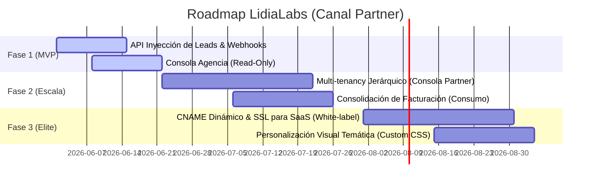

# MEMORÁNDUM INTERNO: ROADMAP DE PRODUCTO Y ARQUITECTURA (ALIANZA ANDRÓMEDA)

**De:** COO, LidiaLabs  
**Para:** Federico Elizondo (CTO), Eugenio Elizondo (CEO)  
**Fecha:** 1 de Junio de 2026  
**Asunto:** Roadmap de Integración Multitenant y Modelo de Negocio para el Canal de Agencias (Caso Andrómeda)

---

## 1. RESUMEN EJECUTIVO & FILOSOFÍA AI-NATIVE (Para el CEO, Eugenio Elizondo)

Este documento detalla el plan estratégico y técnico para transformar a **LidiaLabs** de un modelo SaaS B2B directo, a un modelo **B2B2B (Business-to-Business-to-Business)** apalancado por agencias aliadas.

**Andrómeda** será nuestro primer *Design Partner* de canal, permitiendo que LidiaLabs opere bajo los principios de una **AI-Native Company (Empresa Nativa de IA)**:

* **Agéntico por Diseño (Greenfield):** Rediseñamos el embudo de ventas en torno al agente autónomo de IA en lugar de hacer un *bolt-on* (parchear procesos manuales). Lidia responde e inicia interacciones en <5 segundos desde la inyección del lead.
* **Orquestación de Agentes:** El equipo del distribuidor y los clientes finales dejan de ser ejecutores directos de tareas repetitivas y pasan a orquestar múltiples agentes a gran escala.
* **Infraestructura Prestada:** Apalancamiento total de APIs consolidadas de hiperescaladores y de comunicación, asegurando costos marginales mínimos y un **margen bruto de hasta el 79%**.
* **Sense-Making Humano (Criterio Estratégico):** Validación secuencial del modelo comercial a través de Tiers y pilotos antes de invertir recursos de desarrollo en marca blanca avanzada.

**Impacto Comercial Inmediato:**
1. **CAC de Canal a $0:** Los vendedores de Andrómeda asumen el costo de adquisición de prospectos.
2. **Escalar el MRR Orgánico:** Cada lead de Meta Ads activa a Lidia obligatoriamente para no perder conversión.
3. **Monetizar Setup Fees sin Operar:** Andrómeda realiza el onboarding técnico (Delivery Partner), quedándose con el 70% del setup y LidiaLabs reteniendo el 30% por soporte e infraestructura.

---

## 2. ROADMAP TÉCNICO Y DE NEGOCIO (Hitos Críticos)

El roadmap está dividido en tres fases estratégicas diseñadas para mitigar el riesgo técnico (evitando deuda técnica acelerada para el CTO) y validar tracción comercial rápido (para el CEO).

---

## 3. ARQUITECTURA DE SOLUCIONES Y VALOR DE NEGOCIO (CTO & CEO)

Para habilitar este modelo de negocio sin rediseñar la base de datos completa de Lidia ni generar deuda técnica innecesaria, el equipo de arquitectura de solución ([ARCHITECT.md](file:///Users/diegoandre/Projects/LidiaLabs/TechSquad/ARCHITECT.md)) dictamina las siguientes directrices integradas:

### A. Aislamiento Multitenant Jerárquico (Tenancy Boundary)
* **Decisión de Arquitectura:** Migrar hacia un esquema de base de datos relacional con políticas de seguridad a nivel de fila (**RLS** en PostgreSQL) utilizando llaves compuestas (`partner_id` y `organization_id`).
* **Necesidad Técnica (CTO):** Permite aislar herméticamente los datos de cada cliente final de la agencia a nivel de motor de base de datos, evitando que queries mal formados expongan datos entre inquilinos.
* **Impacto Comercial (CEO):** Garantiza cumplimiento estricto de privacidad y soberanía de datos (esencial para nichos de alta sensibilidad como el **médico/salud** y corporativo), reduciendo a cero el riesgo legal de LidiaLabs por fugas de información.

### B. Ecosistema de Integración e Inyección Asíncrona (Lead Ingestion)
* **Decisión de Arquitectura:** Diseñar una API REST de inyección de leads genérica desacoplada del motor de procesamiento de lenguaje natural de la IA, delegando el procesamiento a colas de mensajería (Redis Queue).
* **Necesidad Técnica (CTO):** Evita la saturación del servidor principal ante picos de tráfico en las campañas publicitarias de Andrómeda y previene bloqueos de I/O en la API de WhatsApp.
* **Impacto Comercial (CEO):** Garantiza un tiempo de respuesta (*Speed to Lead*) menor a 5 segundos de forma constante, maximizando la tasa de conversión y demostrando el ROI a los clientes de la agencia de inmediato.

### C. Infraestructura de Marca Blanca (White-Label Routing)
* **Decisión de Arquitectura:** Implementar un proxy inverso (usando Cloudflare for SaaS o Nginx dinámico) para enrutamiento dinámico de dominios de terceros y renderizado dinámico de estilos (CSS/Logos) en base al host de origen.
* **Necesidad Técnica (CTO):** Evita tener que compilar y redesplegar instancias del frontend por cada dominio personalizado de las agencias afiliadas.
* **Impacto Comercial (CEO):** Habilita la venta de planes "Enterprise" o marca blanca de alta rentabilidad, incrementando el valor percibido y forzando un alto *lock-in* (dependencia) de los clientes finales con la infraestructura de la agencia y de LidiaLabs.

---

## 4. ANÁLISIS COMERCIAL Y UNIT ECONOMICS (Para el CEO, Eugenio Elizondo)

### A. Estructura de Margen y Costos (Unit Economics)
Bajo el esquema de descuentos por volumen (*Wholesale Tiers*), protegemos nuestros costos de infraestructura (cómputo de LLM y costo por mensaje enviado de WhatsApp API):

* **Costo Fijo LidiaLabs por Cuenta Activa:** ~$8 USD / mes (Infraestructura base + OpenAI / Gemini API tokens para chats de bajo volumen).
* **Precio de Lista Lidia (Público):** $49 USD / mes.
* **Tier 1 (20% Desc - 1 a 10 cuentas):** Andrómeda nos paga $39 USD/mes. *Margen neto para LidiaLabs: 79%.*
* **Tier 2 (35% Desc - 11 a 50 cuentas):** Andrómeda nos paga $31.8 USD/mes. *Margen neto para LidiaLabs: 74%.*
* **Tier 3 (50% Desc - 51+ cuentas):** Andrómeda nos paga $24.5 USD/mes. *Margen neto para LidiaLabs: 67%.*

*Conclusión Comercial:* Incluso en el tier más alto, LidiaLabs mantiene un margen bruto del **67%**, con el beneficio adicional de que el costo de soporte de primer nivel y la cobranza la asume Andrómeda.

### B. Plan de Mitigación de Fricción (User Voice Proxy)
Para asegurar que los clientes de Andrómeda no tengan una mala experiencia y cancelen el servicio (Churn):
* **Fricción Identificada:** La calibración del prompt (cómo responde el bot) suele fallar si la agencia no sabe redactar instrucciones claras.
* **Solución de Producto:** Crearemos plantillas de prompts pre-estructuradas dentro del dashboard para los nichos clave de Andrómeda (Médicos y PYMEs). Así, el implementador de la agencia solo tiene que llenar campos clave (Nombre del negocio, horarios, servicios y links de agendamiento) en lugar de redactar prompts desde cero.
