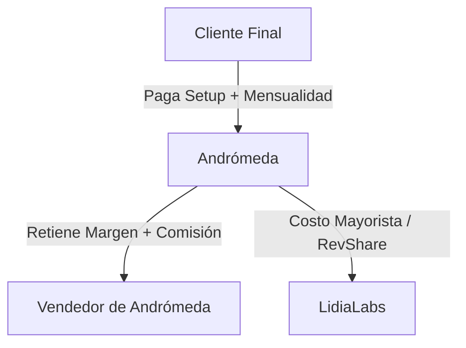

# Propuesta de Alianza Estratégica: LidiaLabs & Andrómeda

**Documento Comercial y Operativo**
*Fecha: 1 de Junio de 2026*
*Estado: Borrador de Discusión (GTM & Partnerships)*

---

## 1. Visión General de la Sinergia
**Andrómeda** posee la penetración de mercado (Médicos, PYMEs y Corporativos) y la capacidad de producción creativa/audiovisual. **LidiaLabs** provee la infraestructura de crecimiento autónomo (agente de IA conversacional y CRM). 

Esta alianza permite a Andrómeda ofrecer una solución de automatización de alto valor (Lidia), empaquetada como un servicio propio o en co-branding, generando:
1. **Flujo de Caja Inmediato:** Cobro por la implementación inicial (Setup Fee).
2. **Ingresos Recurrentes (MRR):** Mensualidad por el uso de la infraestructura de Lidia.

---

## 2. Modelo Comercial y de Incentivos

Diseñado bajo la regla de **Revenue-First** y volumen para incentivar a la fuerza de ventas de Andrómeda.

### A. Cobro de Implementación (Setup Fee)
La configuración inicial (prompts, integraciones de calendario/CRM y pruebas de tono de voz) tiene un costo único para el cliente.
* **Modelo Delivery Partner (Recomendado):** Andrómeda realiza el onboarding y configuración técnica básica usando el panel sin código de Lidia.
  * *Split:* **70% para Andrómeda / 30% para LidiaLabs** (soporte de 3er nivel e infraestructura).
* **Modelo Referral:** Andrómeda solo vende, LidiaLabs implementa.
  * *Split:* **30% comisión para Andrómeda / 70% para LidiaLabs**.

### B. Licenciamiento Mensual Recurrente (MRR) - Esquema Mayorista
Para fomentar la escala masiva de clientes, proponemos un esquema de precios por volumen (Wholesale Tiers) sobre el precio comercial de Lidia:

| Tier | Cuentas Activas | Descuento sobre Tarifa Base Lidia | Margen Mensual para Andrómeda |
| :--- | :--- | :--- | :--- |
| **Tier 1 (Inicio)** | 1 - 10 cuentas | **20% de descuento** | 20% + Markup opcional |
| **Tier 2 (Escala)** | 11 - 50 cuentas | **35% de descuento** | 35% + Markup opcional |
| **Tier 3 (Elite)** | 51+ cuentas | **50% de descuento** | 50% + Markup opcional |

*Nota: Andrómeda factura directamente al cliente final, dándoles la libertad de empaquetar Lidia dentro de sus "Retainers" mensuales de marketing.*

---

## 3. Playbook de Ventas para los Vendedores de Andrómeda

### Pitch de 30 Segundos
> *"Actualmente te ayudamos a atraer prospectos con nuestras campañas y contenido. Pero, ¿cuántos de esos leads se pierden porque no respondes en 5 segundos o escriben fuera de horario? Te vamos a implementar a **Lidia**, una agente de IA en tu propio número de WhatsApp que atiende, califica y agenda citas directamente en tu calendario 24/7. Nosotros nos encargamos de configurarla con la voz de tu marca."*

### Matriz de Objeciones
* **¿Es un chatbot con menús molestos?** No. Lidia habla de forma natural en lenguaje humano. No hay menús de "Presione 1".
* **¿Tengo que cambiar mi número?** No, se conecta al mismo número de WhatsApp Business que ya usa la empresa en 5 minutos.
* **¿Qué pasa si la IA no sabe responder algo?** Se transfiere la conversación al inbox del equipo humano para que tomen el control.

---

## 4. Plan de Activación (MVP Quirúrgico)

Para evitar el *process creep*, validamos la alianza en 3 pasos rápidos:

1. **Paso 1: Demo Sandbox (Semana 1):** Creamos una cuenta demo de Lidia pre-configurada para que los vendedores de Andrómeda puedan mostrarla en vivo a sus prospectos actuales.
2. **Paso 2: Piloto con 3 Clientes (Semana 2-3):** Andrómeda selecciona 3 clientes actuales (ej. un especialista médico y una PYME) para implementar el agente. LidiaLabs acompaña de cerca en el onboarding para asegurar éxito.
3. **Paso 3: Apertura del Canal (Semana 4):** Lanzamiento oficial a toda la fuerza de ventas de Andrómeda con incentivos de comisión directa por setup cerrado.
